# DataVerse 2 PM Technical EDA Report

## Problem

Predict Bengaluru residential property prices from structured property attributes. This is a regression problem, and the contest target metric for the housing track is RMSLE.

## Dataset Snapshot

- Raw rows: 1000
- Rows after cleaning/outlier removal: 917
- Removed outlier/noisy rows: 83
- Columns: 10
- Unique locations: 20
- Target column: `price`

## Cleaning Decisions

- Standardized location strings into a lowercase `location_clean` field.
- Converted area into a numeric sqft feature.
- Removed invalid or unrealistic training records, including negative prices, impossible BHK/bath counts, and unusual sqft-per-BHK values.
- Preserved categorical columns for one-hot encoding inside the model pipeline.

## Hidden Signals Found

- Location is a strong price signal, especially through median price per sqft.
- Area and BHK are useful, but area alone is not enough because premium localities can dominate price.
- Engineered ratios such as sqft per BHK and bath per BHK help describe compact versus spacious properties.
- Furnishing, parking, balcony, and property type add smaller but useful signals.

## Generated Plots

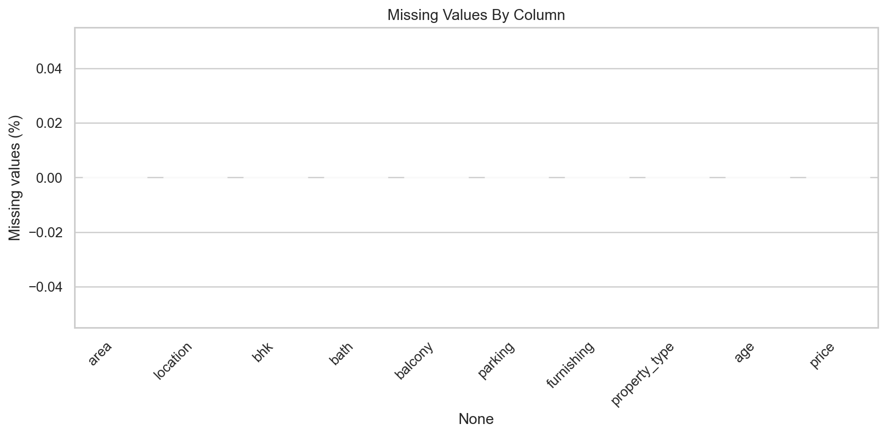
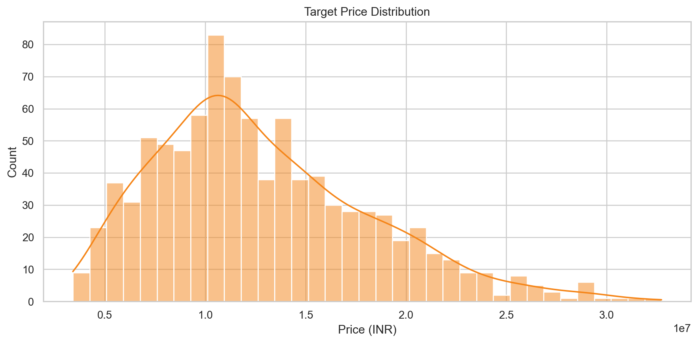
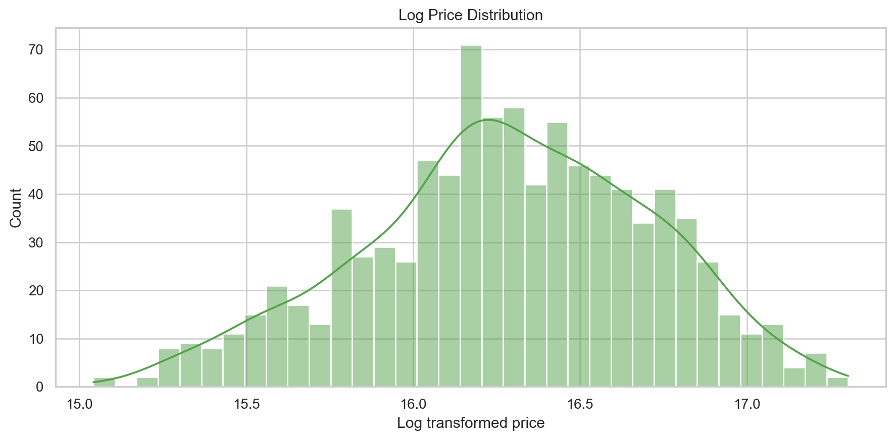
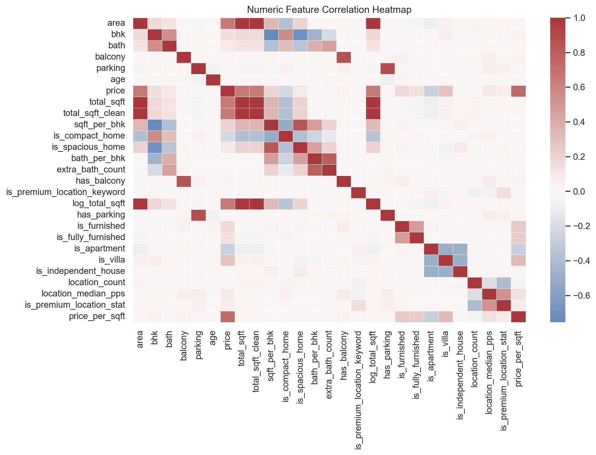
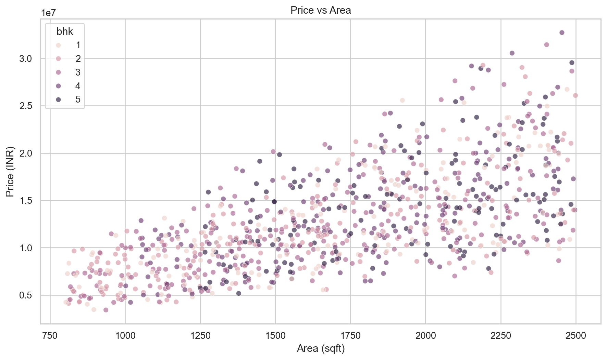
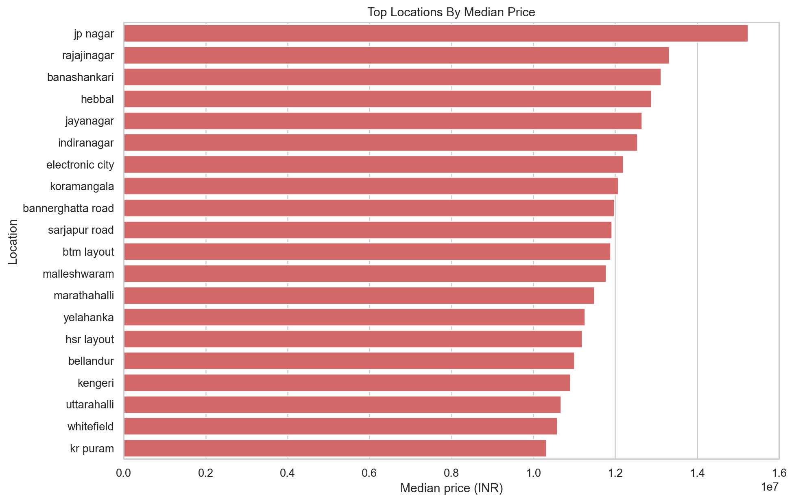
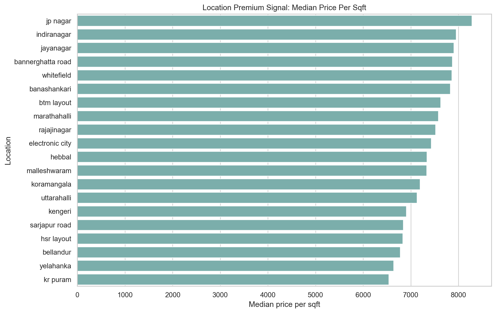
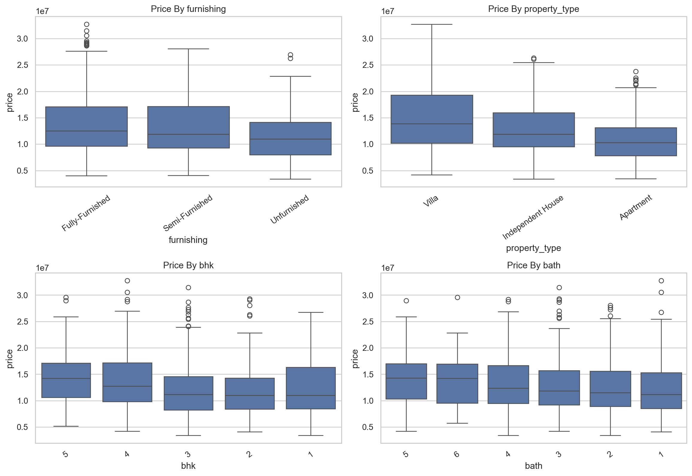
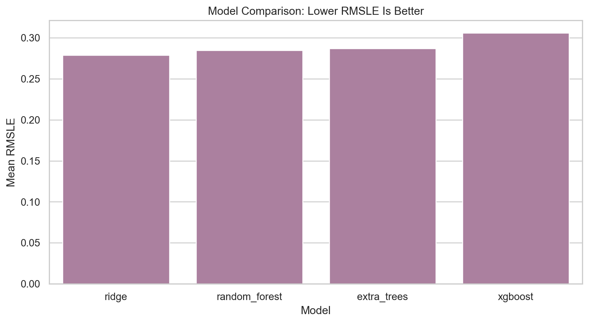
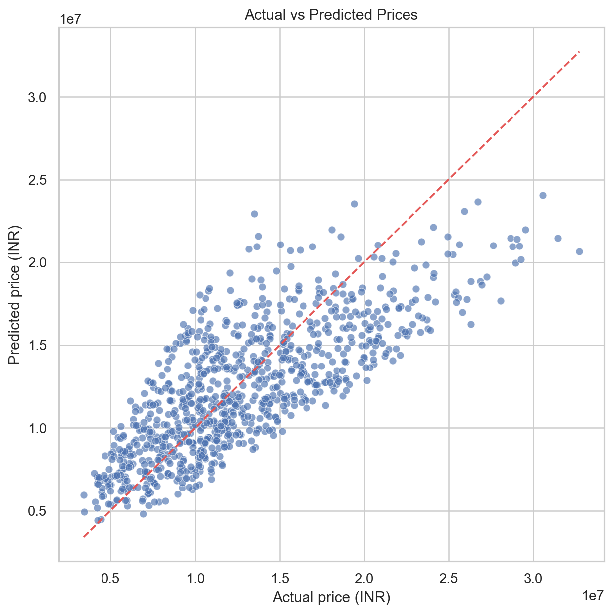
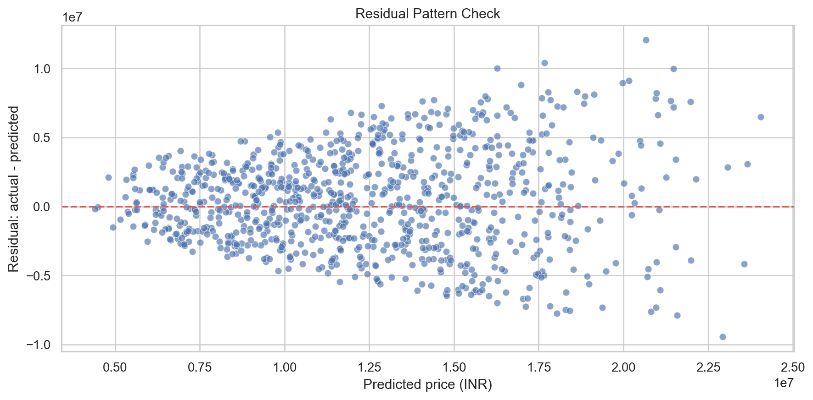
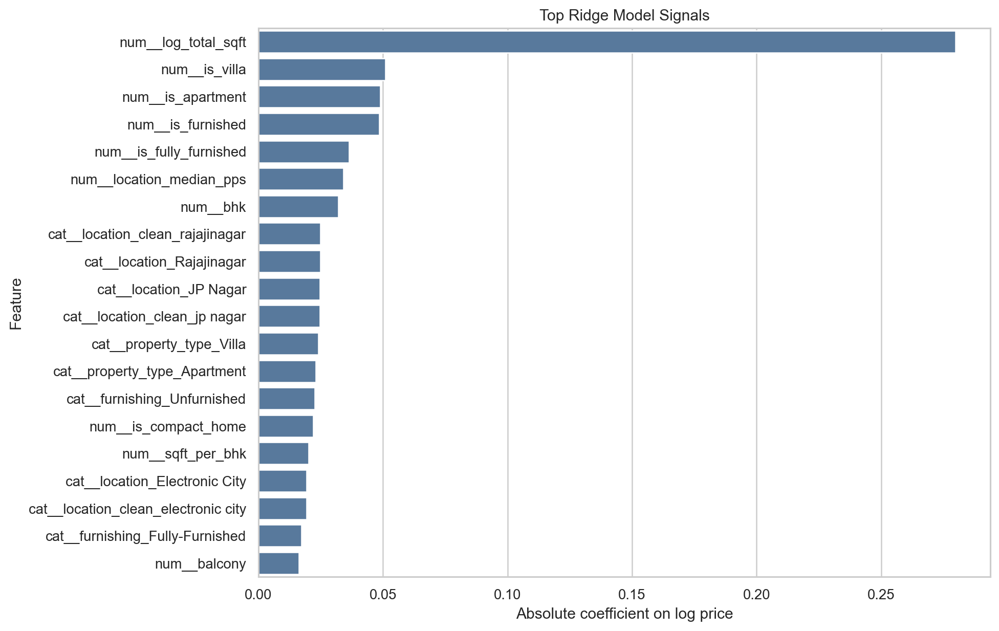
